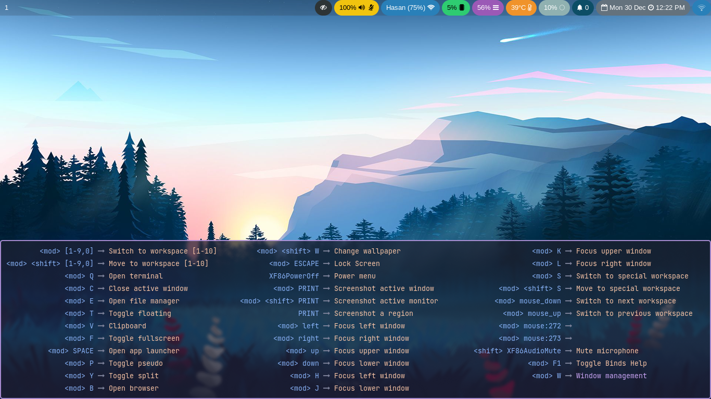
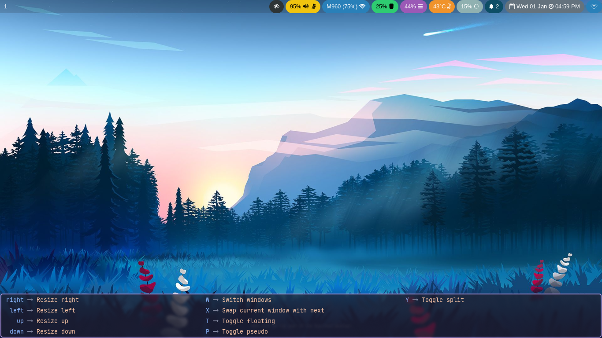

## Hyprwhichkey

Which-Key for [Hyprland](https://hyprland.org/)

> [!NOTE]
> Hyprwhichkey was inspired by the **eww which-key example** of the [Hyprhook](https://github.com/Hyprhook/Hyprhook/) plugin. However, since I am not familiar with the **Yuck programming language**, I found it difficult to make tiny adjustments. To address this, I created **Hyprwhichkey** using **TypeScript** with [ags](https://github.com/aylur/ags) (Astal) for better flexibility and ease of use.

---

### Table of Contents

1. [Prerequisites](#prerequisites)
2. [Installation](#installation)
3. [Usage](#usage)
4. [Showcase](#showcase)
5. [Contributing](#contributing)
6. [License](#license)

---

### Prerequisites

Ensure you have [ags](https://github.com/aylur/ags) v2 installed before proceeding.

---

### Installation

1. Clone the repository:

   ```bash
   git clone https://github.com/Juhan280/hyprwhichkey.git && cd hyprwhichkey
   ```

2. Bundle the application:

   ```bash
   ags bundle src/app.ts /path/to/bundle/file
   ```

3. Add the script to start at system boot:

   ```ini
   exec-once = gjs -m /path/to/bundle/file
   ```

4. Configure keybind and blur:

   ```ini
   bindd = SUPER, F1, Toggle Binds Help, exec, astal -i hyprwhichkey

   # For blurring background of hyprwhichkey
   # Make sure to enable blur in decoration
   layerrule = blur, hyprwhichkey
   ```

---

### Usage

Keybinds won't appear unless you add the [description flag](https://wiki.hyprland.org/Configuring/Binds/#description) using `bindd`. However, you can leave the description empty while setting the flag, and it will automatically fall back to displaying the dispatcher instead.

---

### Showcase




---

### Contributing

We welcome contributions! To get started:

1. Fork the repository.
2. Create a feature branch (`git checkout -b feature-name`).
3. Commit your changes (`git commit -m 'Add feature'`).
4. Push to the branch (`git push origin feature-name`).
5. Create a Pull Request.

---

### License

This project is licensed under the MIT License. See [LICENSE.txt](LICENSE.txt) for details.
