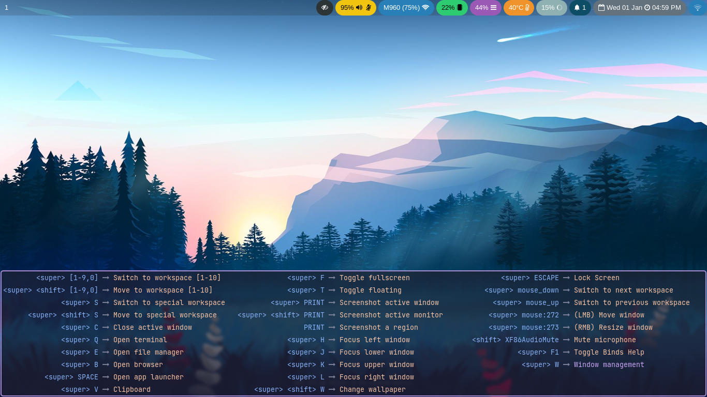

## Hyprwhichkey

Which-Key for [Hyprland](https://github.com/hyprwm/Hyprland)

---

### Table of Contents  
1. [Prerequisites](#prerequisites)  
2. [Installation](#installation)  
3. [Usage](#usage)  
4. [Showcase](#showcase)  
5. [Contributing](#contributing)  
6. [License](#license)

---

### Prerequisites  

Ensure you have the following dependencies installed before proceeding:  
- [Hyprhook](https://github.com/Hyprhook/Hyprhook/)  
- [ags](https://github.com/aylur/ags)  

---

### Installation  

1. Clone the repository:  
   ```bash
   git clone https://github.com/Juhan280/hyprwhichkey.git && cd hyprwhichkey
   ```

2. Bundle the application:  
   ```bash
   ags bundle app.ts /path/to/bundle/file
   ```

3. Add the script to start at system boot:  
   ```ini
   exec-once = gjs -m /path/to/bundle/file
   ```

4. Configure keybinds and hooks in your `hyprland.conf`:  
   ```ini
   bindd = SUPER, F1, Toggle Binds Help, exec, astal -i hyprwhichkey base

   plugin {
       hyprhook {
           onSubmap = astal -i hyprwhichkey
       }
   }
   ```

---

### Usage  

- **Toggle Help Menu:** Press `SUPER + F1` to view the binds help menu.  
- **Dynamic Hook Integration:** The `hyprhook` plugin seamlessly detects submap changes and activates the which-key interface.

---

### Showcase  




---

### Contributing  

We welcome contributions! To get started:  
1. Fork the repository.  
2. Create a feature branch (`git checkout -b feature-name`).  
3. Commit your changes (`git commit -m 'Add feature'`).  
4. Push to the branch (`git push origin feature-name`).  
5. Create a Pull Request.  

---

### License  

This project is licensed under the MIT License. See [LICENSE.txt](LICENSE.txt) for details.  

